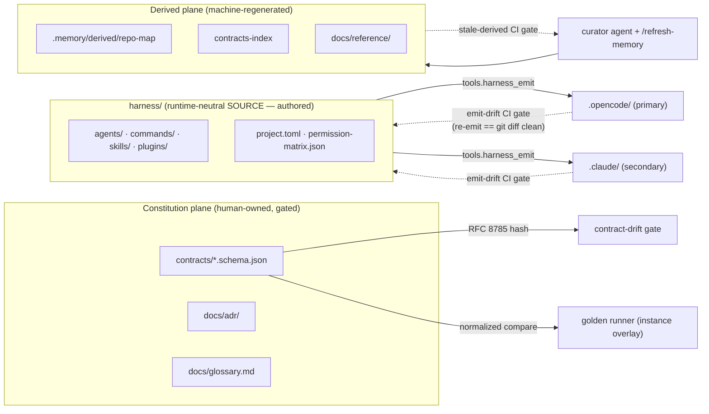

<div align="center">

# Contract-First Polyglot Agent-Harness Template

**계약(contracts)을 단일 정본으로 두고, 폴리글랏 표현차·레거시 전환 리스크를 하네스가 자동으로 강제·검증한다.**

A reusable, **contract-first** harness that lets coding **agents** build, maintain, and refactor a
responsibility-split **polyglot** monorepo — where "how we develop here" lives as executable
**skills, commands, and hooks**, not tribal knowledge.

[](.github/workflows/ci.yml)
[](#-quickstart)
[](#-single-source--dual-runtime)
[](harness/project.toml)
[-3776AB)](pyproject.toml)
[](.planning/MILESTONES.md)
[](README.ko.md)
[](#-license)

[What it is](#-what-it-is) · [Why](#-why) · [Features](#-features) · [Architecture](#-architecture) · [Quickstart](#-quickstart) · [Layout](#-repository-layout) · [Concepts](#-core-concepts) · [Roadmap](#-roadmap) · [한글 설명서](README.ko.md)

</div>

---

## 🧭 What it is

This repo is **not an application** — it is a **template harness**. The product is the harness itself:

- **opencode** (primary) + **Claude Code** (secondary) artifacts — `agents`, `commands`, `skills`,
  `plugins`, `opencode.json` — generated from **one runtime-neutral source** under `harness/`.
- A **Diátaxis + ADR + contracts** documentation structure.
- A two-plane **context-memory** layer (human-owned *constitution* vs machine-regenerated *derived*)
  that survives across sessions.

The semiconductor equipment-log domain that seeded it is demoted to a **reference instance** under
[`examples/log-parser/`](examples/log-parser); the core depends on **no** instance.

## 💡 Why

Polyglot monorepos rot at the seams: the same contract is expressed differently in each language,
and legacy→new migrations silently drift. This harness makes the **contract the single source of
truth** and turns every guardrail into something executable:

> **Contracts are authoritative. If code disagrees with a contract, the code is wrong.**
> **Machines gate, humans ratify** — an agent may *propose* but never self-bless a golden baseline
> or mutate the constitution plane.

## ✨ Features

| | Feature | What it gives you |
|---|---|---|
| 📜 | **Contract-first gate** | JSON Schema (Draft 2020-12) contracts + an RFC 8785 (JCS) schema-hash **drift gate** — a contract change without a paired golden update fails CI. |
| 🥇 | **Golden equivalence** | Legacy↔new comparison via **normalized** equivalence (BOM/CRLF/decimal-locale/timezone/float-tolerance canonicalized), never a naïve byte-diff. |
| 🧠 | **Two-plane memory** | Human-owned *constitution* (`contracts/`, `docs/adr/`, `docs/glossary.md`) vs auto-regenerated *derived* (`repo-map`, `contracts-index`, `docs/reference/`) — with a **self-maintaining curator** + CI freshness gate. |
| 🔁 | **Single-source → dual-runtime** | Author once in `harness/`; emit **byte-identical** to `.opencode/` **and** `.claude/`, enforced by a non-bypassable `emit-drift` CI job. |
| 🌐 | **Polyglot boundary** | Language boundary = process/file/DB only (never in-process object passing); a boundary linter enforces the §4.3–4.6 canonicalization invariants on wire files. |
| 🪝 | **Runtime hooks** | `contract-guard`, `polyglot-lint`, `format-on-write`, `commit-gate` — prose advice made enforceable. |
| 🧩 | **Multi-repo workspace** | `workspace.toml` declares member repos + cross-repo edges; drift/golden gates and pipeline topology extend across repo boundaries. |
| 🚦 | **CI fan-in** | A multi-job matrix (`setup, lang-tests, contract-check, drift, golden, core-suite, lint, emit-drift, stale-derived, workspace, gate`) all green before merge. |

## 🏗 Architecture

Everything under `.opencode/` and `.claude/` is **generated** — never hand-edited.



**Stack:** parser/converter = **.NET 10** (CPU-bound); scheduler/collector + all `tools/` =
**Python 3.11+ / uv** workspace; plugins + emitter = **Node**. Primary runtime **opencode**,
secondary **Claude Code**.

## 🚀 Quickstart

> Prereqs: [`uv`](https://docs.astral.sh/uv/) (Python workspace). The .NET 10 side is optional and
> installed on demand via `tools/bootstrap/`; the full Python suite runs without it.

```bash
# 1. Sync the uv workspace (root pyproject.toml + all tools/ + libs/python members)
uv sync --all-packages

# 2. Run the full harness test suite  (1075 passing)
uv run pytest -q

# 3. Re-emit the runtime surfaces from harness/ source, then prove it's byte-identical
uv run python -m tools.harness_emit
git diff --exit-code -- .opencode .claude/agents .claude/commands .claude/skills opencode.json AGENTS.md

# 4. Validate contracts + the schema-hash drift gate
uv run python -m tools.contract_drift.drift            # single-repo
uv run python -m tools.contract_drift.drift --workspace # across workspace.toml members
```

Common developer flows are packaged as **commands/skills** (emitted to both runtimes):
`/add-language`, `/adopt`, `/adr`, `/agree`, `/build`, `/checkpoint`, `/component`,
`/contract-check`, `/docs-sync`, `/fan-out-synthesize`, `/flow`, `/lint`, `/new-contract-rule`,
`/orient`, `/refresh-memory`, `/review`, `/test`, and `/verify-work`.

## 📁 Repository layout

```
harness/            # ★ runtime-neutral SOURCE of the agent surface (authored here)
  agents/           #   5 personas: orchestrator, code-reviewer, explorer, python-engineer, curator
  commands/ skills/ plugins/
  project.toml      #   GEN-03 language/toolchain slot (pure DATA)
  permission-matrix.json
.opencode/ .claude/  # GENERATED runtime trees (do not hand-edit)  ← tools.harness_emit
opencode.json        # GENERATED wholesale config (15-key permission block)
workspace.toml       # multi-repo manifest: members + cross-repo edges (pure DATA)

contracts/           # constitution plane — JSON Schema contracts (single source of truth)
docs/                # Diátaxis (tutorials/how-to/reference/explanation) + adr/ + glossary
tools/               # Python tooling: harness_emit, contract_drift, memory_regen,
                     #   docs_sync, polyglot_lint, harness_lint, workspace_config, hooks, …
libs/                # language-neutral normalize core + fixtures (Python side)
components/          # component packages
examples/log-parser/ # the reference instance (domain-specific; core depends on NONE of it)
.planning/           # GSD workflow state: PROJECT.md, ROADMAP.md, MILESTONES.md, phases/, milestones/
AGENTS.md CLAUDE.md  # nearest-wins agent rules (partly HARNESS-MANAGED, spliced by the emitter)
```

## 🧱 Core concepts

- **Contract-first** — `contracts/` outranks code. Changes are canonicalized (RFC 8785) → SHA-256 →
  committed hash; CI recomputes and **fails on drift without a paired golden update**.
- **Golden equivalence** — comparison is tolerance-aware and canonicalized across 7 axes (BOM,
  newlines, decimal/culture, float tolerance, row ordering, timezone, TSV escape/null).
- **Two-plane memory** — *constitution* is human-owned & CODEOWNERS-gated; *derived* is
  machine-written and CI-verified (never hand-edited). A `curator` agent owns derived freshness.
- **Single-source → dual-runtime emit** — one Markdown/JSON source, two byte-identical runtime
  trees, guarded by re-emit-diff. Per-runtime limits (skill caps, 15-key permission matrix)
  **fail loud at emit time**, never truncate.
- **GEN-04 no-dependency** — the core never imports or path-references an `examples/` instance or a
  `workspace.toml` member; a guard test proves the single-direction dependency.
- **Machines gate, humans ratify** — a baseline is promoted only when a human sets the
  `GOLDEN_APPROVE_HUMAN` token, and CODEOWNERS routes `/examples/*/golden/` to a human reviewer at
  merge. No agent self-blesses a golden baseline.

## 🗺 Roadmap

v1.0–v2.6 are **shipped & archived** (`.planning/milestones/`, [`MILESTONES.md`](.planning/MILESTONES.md));
**v2.7 is in progress** — Phases 51–53 shipped, Phase 54 open.

<details open>
<summary><b>✅ v1.0 — Foundation (Phases 1–8)</b></summary>

Constitution + golden core · two-plane memory + rules · agents/commands/skills · plugins/hooks ·
de-specialization to a reusable template · generic config-driven CI · single-source dual-runtime
emitter · pipeline-topology conductor + per-component agents.
</details>

<details open>
<summary><b>✅ v2.0 — Long-Horizon (Phases 9–11)</b></summary>

- **α · Self-Maintaining Derived Artifacts + Curator** — read-mostly `curator` + non-bypassable
  `stale-derived` CI gate + cost-split hook posture + `/refresh-memory`.
- **β · Context-Economy Fan-out/Synthesize** — `fan-out-synthesize` skill/command + schema-bounded
  citation-bearing return contract + `context-budget` delegate-vs-inline heuristic.
- **γ · Multi-Repo Workspace** — `workspace.toml` manifest + loader/consistency gate + cross-repo
  drift/golden gates + `repo:stage` pipeline edges + core→workspace-member GEN-04 guard.
</details>

<details open>
<summary><b>✅ v2.1 — Process Memory & Provenance Reframe (Phases 12–16)</b></summary>

Per-guideline PROCESS memory tier (`.memory/agreements/`, human-authored, not derived) · injector
reframe (priority-0 working-agreements directive + data-scoped provenance banner) · `/agree` write
path with an anti-invent provenance guard · emit round-trip gates · local memory web UI.
</details>

<details>
<summary><b>🗑 v2.2 — Adaptive Task Control Plane (Phases 18–23) — shipped, removed in v2.5</b></summary>

Shipped in v2.2 across Phases 18–23 (six phases, ADR-0008 ratified) and **removed in its entirety
in v2.5 under CER-07**, which retired the plane as unearned ceremony. Nothing from it remains in
the repository; this entry is kept as milestone history only.
</details>

<details>
<summary><b>✅ v2.3 — Contract Graph, Brownfield Adoption, Living Docs (Phases 24–29)</b></summary>

Contract relationship graph (ADR-0009) + `/impact` · the `brownfield-adoption` skill · the DERIVED
Diátaxis reference quadrant generated by `docs_sync`.
</details>

<details>
<summary><b>⚠ v2.4 — Gate Right-Sizing, Carried Debt, Lane Discipline (Phases 30–38) — closed PARTIAL</b></summary>

Phases 34–37 shipped; 30 partial; 31/32/33 cut; 38 landed as code and was formalized by v2.5's
Phase 39. Hooks were right-sized to **dev-light, CI-strong**.
</details>

<details>
<summary><b>✅ v2.5 — De-ceremony (Phases 39–46)</b></summary>

Retired unearned ceremony, including the entire v2.2 task-control plane (CER-07), and cut the
harness surface back to what each artifact earns.
</details>

<details>
<summary><b>✅ v2.6 — Minimal Monorepo Core (Phases 47–50a)</b></summary>

The minimal monorepo core plus the `harness-author` anti-sprawl skill. **Phase 50b (managed adopt /
upgrade) was BLOCKED** for want of a real multi-package target and carried into v2.7.
</details>

<details open>
<summary><b>🔄 v2.7 — Real-Target Adoption (Phases 51–54) — in progress</b></summary>

- **51 · Real-Target Observation Baseline** — the harness run against an isolated real target,
  producing an evidence record rather than a success.
- **52 · Evidence-Bounded Real-Target Adoption** — adoption capabilities built only from failures
  Phase 51 actually established.
- **53 · Managed Adopt Updates** — install→update, the unchanged-re-run no-op, and third-party
  files left byte-identical, each proven on the real target.
- **54 · Surface Budget Closeout** — **open**: remove the named duplicate adapter and close the
  surface budget.
</details>

Development is driven by the **GSD** workflow (`.planning/` + `/gsd:*` commands). If you cloned this
as a template, start with **`/gsd:new-project`** — `/gsd:new-milestone` assumes an existing
`PROJECT.md` and prior milestone history, so it is the wrong entry point on a fresh checkout. See
the Korean guide: **[README.ko.md](README.ko.md)**.

> **`.planning/` in this repo is the source project's own history, not yours.** GSD treats a
> populated `.planning/` as an already-initialized project, so clear it (or start from a clean
> snapshot) before running `/gsd:new-project`.

## 🤝 Contributing

- **Never hand-edit** generated trees (`.opencode/`, `.claude/`, `opencode.json`) or derived
  artifacts (`.memory/derived/`, `docs/reference/`) — edit the source under `harness/` / `contracts/`
  and re-run the emitter / regenerators.
- Read the nearest [`AGENTS.md`](AGENTS.md) first; per-package `AGENTS.md` files restate the
  non-negotiables for their subtree.
- Before pushing: `uv run pytest -q`, re-emit and confirm a clean `git diff`, and keep the
  contract-drift / golden gates green. `/verify-work` runs the composite in-session gate.

## 📄 License

No `LICENSE` file is present yet. Add one before any public distribution — until then, all rights
are reserved by the repository owner.

---

<div align="center">
<sub>Built with the GSD workflow · single source in <code>harness/</code> → emitted to opencode + Claude Code · machines gate, humans ratify.</sub>
</div>
